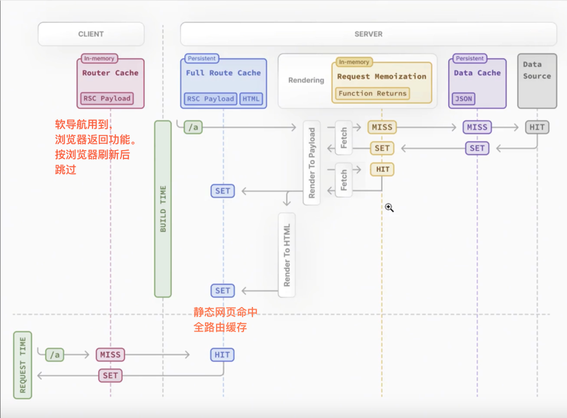

# Next.js + React 19 项目开发学习笔记

## 1. React 19 与 Ant Design 兼容性问题

### 问题描述
React 19 版本发布后，直接使用 Ant Design 会出现组件渲染错误。这是因为 React 19 对 React.createRoot API 进行了更改，导致与 Ant Design 的某些特性不兼容。

### 解决方案
1. 安装 Ant Design v5 补丁包：
```bash
npm install @ant-design/v5-patch-for-react-19
```

2. 在项目入口文件中导入补丁：
```typescript
import '@ant-design/v5-patch-for-react-19';
```

### 知识点
- React 19 引入了新的并发渲染机制
- Ant Design 需要特定的补丁来支持 React 19 的新特性
- 补丁包会自动处理组件的生命周期和事件处理

## 2. Next.js 客户端组件渲染

### 问题描述
在 Next.js 项目中，某些组件需要访问浏览器 API 或使用客户端状态，这些组件必须标记为客户端组件。

### 解决方案
1. 在组件文件顶部添加 'use client' 指令：
```typescript
'use client';

import { useState } from 'react';
```

2. 将客户端逻辑与服务器端逻辑分离：
- 将需要客户端交互的组件标记为客户端组件
- 将数据获取和静态内容放在服务器组件中

### 知识点
- Next.js 默认所有组件都是服务器组件
- 'use client' 指令将组件标记为客户端组件
- 客户端组件可以使用浏览器 API 和 React hooks
- 服务器组件可以减少客户端 JavaScript 包大小

## 3. TypeScript 类型定义和转换

### 问题描述
在使用 TypeScript 开发时，需要正确定义接口类型并处理类型转换，特别是在处理外部数据和组件 props 时。

### 解决方案
1. 使用接口定义数据类型：
```typescript
interface Blog {
  userId: number;
  id: number;
  title: string;
  body: string;
}
```

2. 使用类型断言进行类型转换：
```typescript
const data = response.data as Blog[];
```

### 知识点
- TypeScript 接口用于定义对象的结构
- 类型断言可以告诉编译器变量的具体类型
- 泛型可以创建可重用的类型定义
- 使用类型定义可以提高代码的可维护性和可靠性

## 4. 项目依赖版本管理

### 问题描述
项目使用了最新版本的 React 19 和 Next.js 15，需要确保所有依赖包的版本兼容性。

### 解决方案
1. 在 package.json 中指定精确的依赖版本：
```json
{
  "dependencies": {
    "next": "15.1.7",
    "react": "^19.0.0",
    "react-dom": "^19.0.0",
    "antd": "^5.24.0"
  }
}
```

2. 使用 package-lock.json 锁定依赖版本

### 知识点
- 版本号前缀 ^ 表示允许更新补丁和次要版本
- package-lock.json 确保团队使用相同的依赖版本
- 定期更新依赖可以获得性能改进和安全修复
- 更新依赖时需要进行充分的测试

## 5. Next.js 元数据生成和服务器组件优化

### 问题描述
在 Next.js 应用中，需要为每个页面生成合适的元数据（如标题、描述等），同时需要合理组织服务器组件和客户端组件以优化性能。

### 解决方案
1. 使用 generateMetadata 函数生成动态元数据：
```typescript
export async function generateMetadata({ params }: { params: { id: string } }) {
    return {
        title: `Blog ${params.id}`,
    }
}
```

2. 将客户端交互逻辑分离到独立组件：
- 将包含客户端交互的代码移至 components 目录
- 保持页面组件作为服务器组件，专注于数据获取和布局

### 知识点
- generateMetadata 支持动态生成页面元数据
- 元数据可以基于路由参数和数据动态生成
- 将客户端逻辑分离到组件目录可以：
  - 提高代码组织性
  - 减少主页面的 JavaScript 包大小
  - 实现更好的代码分割
- 服务器组件适合处理：
  - 数据获取
  - 静态内容渲染
  - 元数据生成

## 6. Next.js 客户端组件深入理解

### 问题描述
在使用 Next.js 的客户端组件时，需要深入理解其执行机制和优化策略，以便更好地组织代码结构和提升应用性能。

### 解决方案
1. 合理划分客户端组件和服务器组件：
- 将状态管理和用户交互相关的逻辑放在客户端组件中
- 将数据获取和静态渲染的逻辑保留在服务器组件中

2. 优化客户端组件的性能：
- 使用 React.memo 避免不必要的重渲染
- 将大型客户端组件拆分为更小的可复用组件
- 实现按需加载和代码分割

### 知识点
- 客户端组件在构建时会被打包到客户端 bundle 中
- 客户端组件可以访问浏览器 API 和使用客户端状态
- 合理的组件架构可以：
  - 减少首次加载的 JavaScript 体积
  - 提高页面交互性能
  - 优化服务器端渲染效率
- 性能优化考虑因素：
  - 组件的粒度和职责划分
  - 状态管理的方式
  - 数据获取的策略
  - 代码分割的时机

## 缓存机制

### Next.js 缓存机制概述



### 缓存类型

1. **路由器缓存 (Router Cache)**
   - 客户端缓存最近访问的路由段
   - 提升前进/后退导航体验

2. **完整路由缓存 (Full Route Cache)**
   - 静态渲染路由的 HTML 和 RSC payload
   - 构建时生成，可以通过配置控制
   - 用于静态页面

3. **请求缓存 (Request Memoization)**
   - 在单个渲染过程中重复请求的自动去重
   - 通过 fetch 自动启用
   - 在编译过程中也会命中

4. **数据缓存 (Data Cache)**
   - 持久化存储跨请求的数据
   - 可以通过 fetch 的 cache 选项控制


### 知识点
- 不同类型缓存的使用场景
- 缓存持久化策略
- 缓存失效机制
- 动态数据处理
